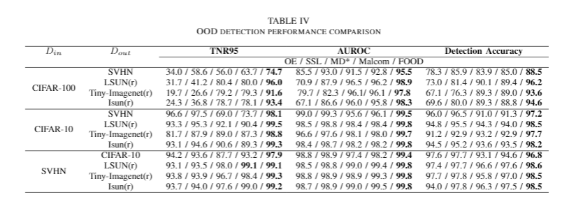
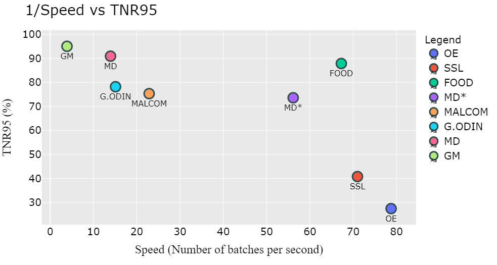
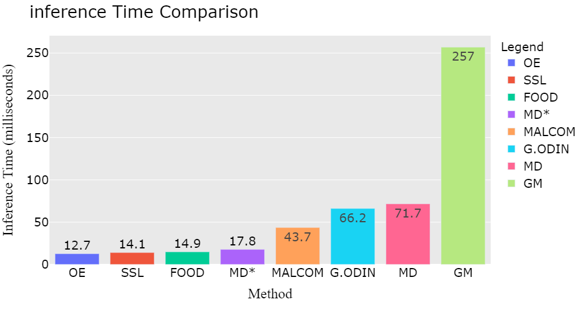

# FOOD - Fast OOD Detector
Pytorch implamentation of the confernce peper FOOD [arxiv link](https://arxiv.org/pdf/2008.06856.pdf).

## Abstract
Deep neural networks (DNNs) perform well at classifying inputs associated with the classes they have been trained on, which are known as in-distribution inputs.
However, out-of-distribution (OOD) inputs pose a great challenge to DNNs and consequently represent a major risk when DNNs are implemented in safety-critical systems.
Extensive research has been performed in the domain of OOD detection.
However, current state-of-the-art methods for OOD detection suffer from at least one of the following limitations: (1) increased inference time - this limits existing methods' applicability to many real-world applications, and (2) the need for OOD training data - such data can be difficult to acquire and may not be representative enough, thus limiting the ability of the OOD detector to generalize.
In this paper, we propose FOOD -- Fast Out-Of-Distribution detector -- an extended DNN classifier capable of efficiently detecting OOD samples with minimal inference time overhead.
Our architecture features a DNN with a final Gaussian layer combined with the log likelihood ratio statistical test and an additional output neuron for OOD detection.
Instead of using real OOD data, we use a novel method to craft artificial OOD samples from in-distribution data, which are used to train our OOD detector neuron.
We evaluate FOOD's detection performance on the SVHN, CIFAR-10, and CIFAR-100 datasets.
Our results demonstrate that in addition to achieving state-of-the-art performance, FOOD is fast and applicable to real-world applications.


## What is in this repository ?
We provide all the necessary tools required in order evaluate OOD detectors.
Including our state of the art OOD detector FOOD.
The repository include the following:
1. FOOD package-containing pytorch implamentation of FOOD and OOD evaluation utilities.
2. Jupyter notebooks demonstrating how to use the FOOD package
3. Pretrained models that were used for our paper evaluation [link](https://drive.google.com/drive/folders/1K53I7XpRxpYAgnHwnHPw5v6UCMbMYaVi?usp=sharing)
4. Efficient Python implamentation of other OOD detection techniques:
    1. MSP-baseline by [Hendrycks & Gimpel et al. 2016](https://arxiv.org/pdf/1610.02136.pdf)
    3. Mahalanobis equal weights by [Lee et al. 2018](https://papers.nips.cc/paper/7947-a-simple-unified-framework-for-detecting-out-of-distribution-samples-and-adversarial-attacks.pdf)
    4. Outlier Exposure by [Hendrycks et al. 2018](https://arxiv.org/pdf/1812.04606.pdf)
    5. Self supervised Learning for OOD detection by(Evaluation Only) [Mohseni et al. 2020](https://aaai.org/ojs/index.php/AAAI/article/view/5966)
5. Downlaod links for OOD evaluation datasets


## FOOD's Results
In this section we provide a brief summerization of FOODs' detection results.

TNR95 table as accepted in the litriture:



Speed Comparison





## FOOD's citation
Cite FOOD using this bibtext:
```
@article{amit2020glod,
  title={GLOD: Gaussian Likelihood Out of Distribution Detector},
  author={Amit, Guy and Levy, Moshe and Rosenberg, Ishai and Shabtai, Asaf and Elovici, Yuval},
  journal={arXiv preprint arXiv:2008.06856},
  year={2020}
}
```

### Software Requirements
```
matplotlib=3.2.1=0
numpy=1.18.5=py38h6530119_0
numpy-base=1.18.5=py38hc3f5095_0
pandas=1.0.5=py38h47e9c7a_0
pip=20.1.1=py38_1
python=3.8.3=he1778fa_0
pytorch=1.5.1=py3.8_cuda102_cudnn7_0
scikit-learn=0.23.1=py38h25d0782_0
scipy=1.5.0=py38h9439919_0
setuptools=47.3.1=py38_0
torchvision=0.6.1=py38_cu102
```

### OOD Evaluation Datasets Download Links
1. [LSUN - resize](https://www.dropbox.com/s/moqh2wh8696c3yl/LSUN_resize.tar.gz)
2. [ISUN](https://www.dropbox.com/s/ssz7qxfqae0cca5/iSUN.tar.gz)
3. [Imagenet](https://www.dropbox.com/s/kp3my3412u5k9rl/Imagenet_resize.tar.gz)

Links taken from the [ODIN](https://github.com/facebookresearch/odin) repository