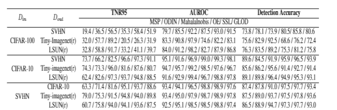
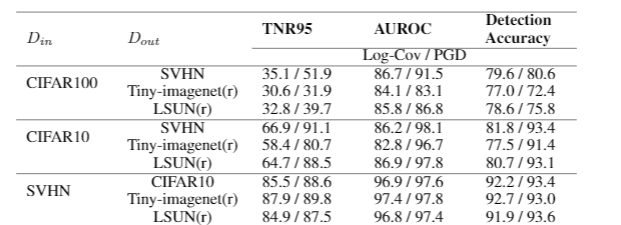
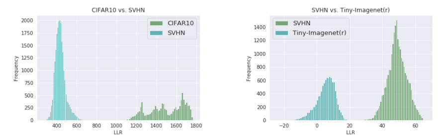

# GLOD - Gaussian Likelihood OOD Detector
Pytorch implamentation of the confernce peper GLOD [arxiv link](www.google.com).

## Abstract
Discriminative deep neural networks (DNNs) do well at classifying input associated with the classes they have been trained on.
However, out-of-distribution (OOD) input poses a great challenge to such models and consequently represents a major risk when these models are used in safety-critical systems.
In the last two years, extensive research has been performed in the domain of OOD detection.
This research has relied mainly on training the model with OOD data or using an auxiliary (external) model for OOD detection.
Such methods have limited capability in detecting OOD samples and may not be applicable in many real world use cases.
In this paper, we propose GLOD -- Gaussian likelihood layer out of distribution detector -- an extended DNN classifier capable of efficiently detecting OOD samples without relying on OOD training data or an external detection model.
\MethodName uses a layer that models the Gaussian density function of the trained classes.
The layer outputs are used to estimate a log-likelihood ratio which is employed to detect OOD samples.
We evaluate GLOD's detection performance on three datasets: SVHN, CIFAR-10, and CIFAR-100.
Our results show that GLOD surpasses state-of-the-art OOD detection techniques in detection performance by a large margin.

## What is in this repository ?
We provide all the necessary tools required in order evaluate OOD detectors.
Including our state of the art OOD detector GLOD.
The repository include the following:
1. GLOD package-containing pytorch implamentation of GLOD and OOD evaluation utilities.
2. Jupyter notebooks demonstrating how to use the GLOD package
2. Efficient Python implamentation of other OOD detection techniques:
    1. ODIN by [Liang et al. 2017]()
    2. Mahalanobis by [Lee et al. 2018]()
    3. Outlier Exposure by [Hendrycks et al. 2018]()
    4. Self supervised Learning for OOD detection by [Mohseni et al. 2020]()


## GLOD's Results
In this section we provide a brief summerization of GLODs' detection results.

TNR95 table as accepted in the litriture:



TNR99 table, new metric, to evaluate more strictly OOD detection:



Figure demonstrating the seperation between OOD LLR scores and In distribution LLR scores:




## GLOD Package
GLOD package for pytorch
```
pip install glod
```

### Software Requirements
```
matplotlib=3.2.1=0
numpy=1.18.5=py38h6530119_0
numpy-base=1.18.5=py38hc3f5095_0
pandas=1.0.5=py38h47e9c7a_0
pip=20.1.1=py38_1
python=3.8.3=he1778fa_0
pytorch=1.5.1=py3.8_cuda102_cudnn7_0
scikit-learn=0.23.1=py38h25d0782_0
scipy=1.5.0=py38h9439919_0
setuptools=47.3.1=py38_0
torchvision=0.6.1=py38_cu102
```